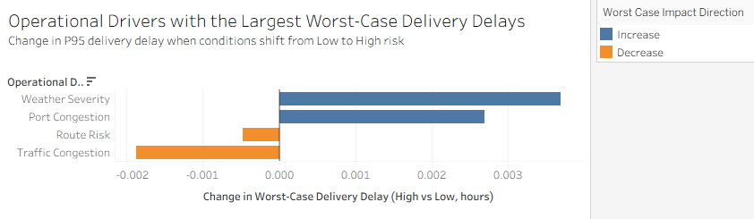
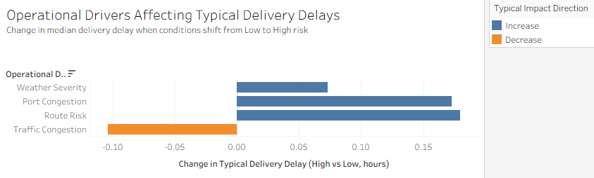
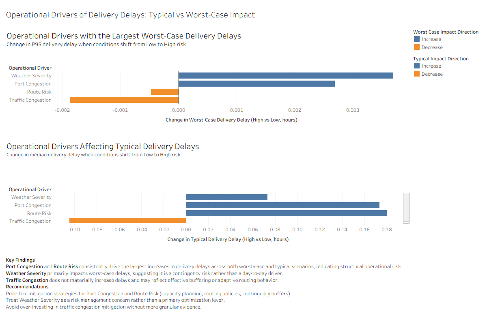

# Logistics Delivery Delay Analysis

## Table of Contents

- [Project Background](#project-background)
- [Executive Summary](#executive-summary)
- [Data Overview](#data-overview)
- [Analytical Approach](#analytical-approach)
- [Key Insights](#key-insights)
  - [Delivery Delay Impact by Operational Drivers](#delivery-delay-impact-by-operational-drivers)
  - [Worst-Case vs Typical Delay Risk](#worst-case-vs-typical-delay-risk)
  - [Driver Impact Ranking](#driver-impact-ranking)
- [Dashboard Overview](#dashboard-overview)
- [Recommendations](#recommendations)
- [Assumptions & Caveats](#assumptions--caveats)
- [Tools & Technologies](#tools--technologies)
- [Repository Structure](#repository-structure)

## Project Background

Logistics operations are highly sensitive to both environmental and operational conditions. Factors such as port congestion, traffic levels, weather severity, and route risk can compound and lead to delivery delays that disrupt supply chains and increase operational costs.

While delays are often discussed in terms of average performance, operational risk is more accurately reflected by **worst-case outcomes** that occur under adverse conditions.

This project was designed to evaluate delivery performance under varying risk conditions by comparing **low-risk vs high-risk scenarios** across multiple operational drivers.

## Executive Summary

Delivery delays create significant operational and financial risk in logistics networks, particularly when adverse conditions compound across multiple operational drivers.

This project analyzes how delivery performance changes under increasing risk conditions across key operational and environmental drivers. Using SQL-based analysis in BigQuery and interactive dashboards built in Tableau, the project quantifies both **typical delays (median)** and **worst-case delays (P95)**.

## Data Overview

The analysis is based on a structured logistics events dataset representing delivery operations over time.

- **Granularity:** Individual delivery-level observations  
- **Metrics:** Delivery time deviation, ETA variation, delay probability  
- **Drivers:** Port congestion, traffic congestion, weather severity, route risk  

Continuous risk indicators were segmented into **Low / Medium / High relative risk levels** using distribution-based bucketing.

## Analytical Approach

The analysis evaluates delivery performance under increasing operational risk using:

- **Median delay** to represent typical performance  
- **P95 delay** to capture worst-case risk  

Drivers were ranked by the increase in worst-case delay when shifting from low-risk to high-risk conditions.

## Key Insights

### Delivery Delay Impact by Operational Drivers

Delivery performance degrades as conditions move from low-risk to high-risk levels, with worst-case delays showing greater sensitivity than typical delays.

### Worst-Case vs Typical Delay Risk

Extreme delays disproportionately affect a small subset of deliveries, indicating that risk concentrates in tail events rather than averages.

### Driver Impact Ranking

No single driver overwhelmingly dominates delay escalation. Delivery instability emerges from the combined effect of multiple operational factors.

## Dashboard Overview

### Worst-Case Delivery Delay Impact by Driver



### Typical Delivery Delay Impact by Driver



### Full Dashboard View



## Recommendations

- Monitor **worst-case delay metrics** rather than averages alone  
- Adopt **system-wide risk monitoring** across operational drivers  
- Use **relative risk thresholds** for early intervention  

## Assumptions & Caveats

- Risk levels are relative, not absolute thresholds  
- Drivers are analyzed independently  
- Delay severity is emphasized over frequency  

## Tools & Technologies

- SQL (BigQuery)
- Tableau
- Git & GitHub
- Markdown

## Repository Structure

```text
logistics-delivery-delay-analysis/
│
├── README.md
├── sql/
│   ├── 01_data_validation.sql
│   ├── 02_kpi_definitions.sql
│   ├── 03_driver_bucket_analysis.sql
│   └── 04_driver_impact_ranking.sql
├── dashboards/
│   ├── logistics_delay_dashboard.pdf
│   └── dashboard_screenshots/
│       ├── dashboard_full.png
│       ├── worst_case_driver_impact.png
│       └── typical_delay_driver_impact.png
├── data/
│   └── data_source.md
└── project_notes/
    └── analysis_summary.md
